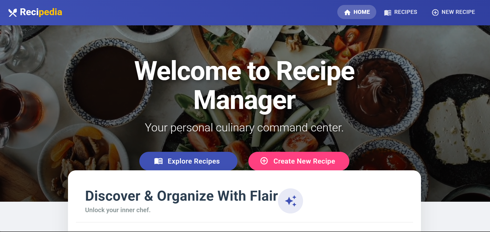
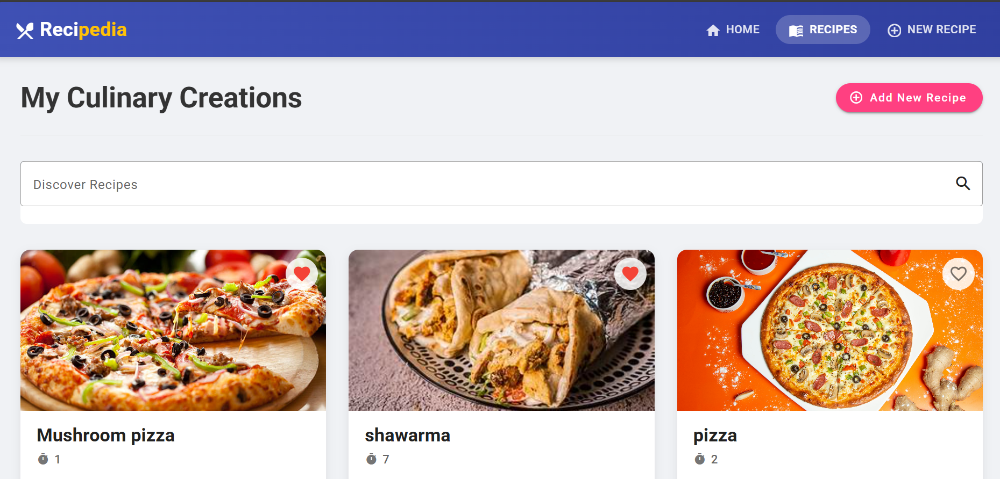
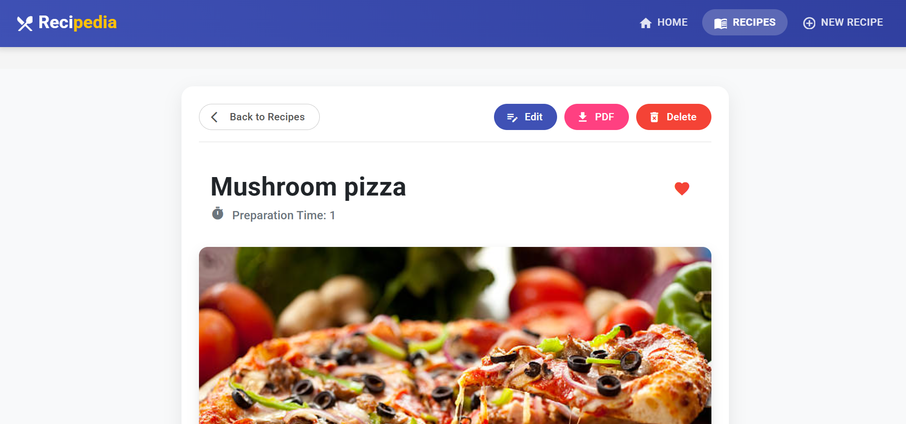
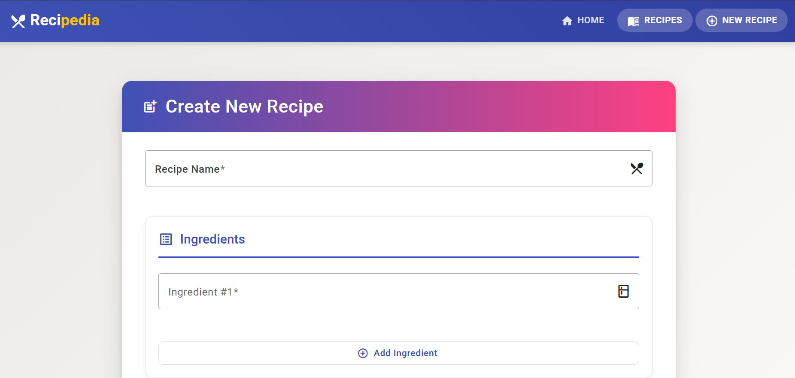
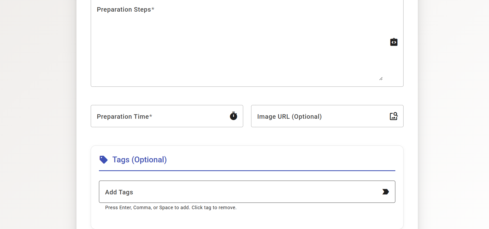
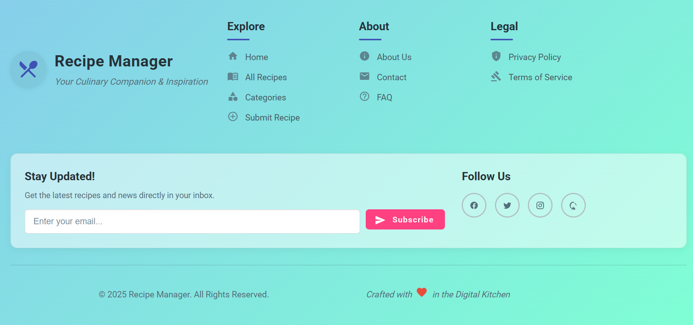

# Recipe Manager Application

A full-stack application for managing recipes built with Angular 19 and Node.js.

## Features

- Create, read, update, and delete recipes
- Search and filter recipes by name, ingredients, or tags
- Responsive design for mobile and desktop
- Form validation and error handling
- Material Design components

## Technology Stack

### Frontend
- Angular 19
- Angular Material
- RxJS
- TypeScript

### Backend
- Node.js
- Express
- MongoDB
- Mongoose

## Setup Instructions

### Prerequisites
- Node.js (v14+)
- MongoDB (local or MongoDB Atlas)

### Installation

1. Clone the repository
   ```
   git clone <repository-url>
   cd recipe-manager
   ```

2. Install dependencies
   ```
   npm install
   ```

3. Configure environment variables
   Create a `.env` file in the root directory with the following:
   ```
   PORT=3000
   MONGO_URI=mongodb://localhost:27017/recipe-manager
   NODE_ENV=development
   ```

4. Start the application
   ```
   npm run dev
   ```
   This will start both the frontend (on port 4200) and backend (on port 3000) concurrently.

## API Documentation

### Available Endpoints

| Method | Endpoint           | Description                 |
|--------|--------------------|-----------------------------|
| GET    | /api/recipes       | Get all recipes             |
| GET    | /api/recipes/:id   | Get a specific recipe by ID |
| POST   | /api/recipes       | Create a new recipe         |
| PUT    | /api/recipes/:id   | Update a recipe             |
| DELETE | /api/recipes/:id   | Delete a recipe             |

### Recipe Model

```typescript
{
  _id?: string;
  name: string;         // required
  ingredients: string[];// required
  steps: string;        // required
  preparationTime: string;
  imageUrl?: string;    // optional
  tags?: string[];      // optional
  createdAt: Date;      // automatically added
  updatedAt: Date;      // automatically added
}
```

## Folder Structure

```
recipe-manager/
  ├── src/                   # Angular frontend code
  │   ├── app/
  │   │   ├── components/    # Angular components
  │   │   ├── models/        # TypeScript interfaces
  │   │   ├── services/      # Angular services
  │   │   └── interceptors/  # HTTP interceptors
  │   ├── assets/            # Static assets
  │   └── global_styles.css  # Global styles
  ├── server/                # Express backend code
  │   ├── controllers/       # Request handlers
  │   ├── models/            # Mongoose models
  │   └── routes/            # API routes
  └── package.json           # Project dependencies
```

## Future Enhancements

- User authentication
- Image upload functionality
- Recipe categories
- User favorites
- Meal planning
- Unit tests
- Docker configuration

## 🎥 Demo Video

 

## 📸 Output

Here are some screenshots of the application:

### 🏠 Home Page



### 🍲 Recipe Page



### 🍲 Recipe Detail Page



### 🍲 Create new recipe page





### 🍲 Footer Page




